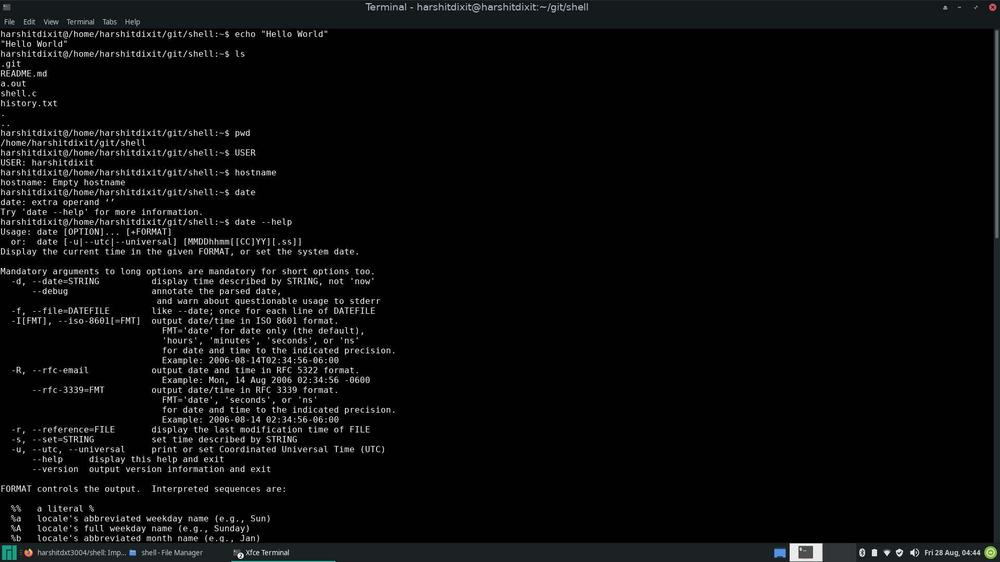

# Shell

Implemented a shell in C.
## How to run
Compile using

<code>gcc shell.c</code>

<code>./a.out</code>
 

## Sample Image

## Functionalities

1. Executes basic shell commands
2. Prints ENV variables too.
3. Has a history.txt which has all the commands executed till now.